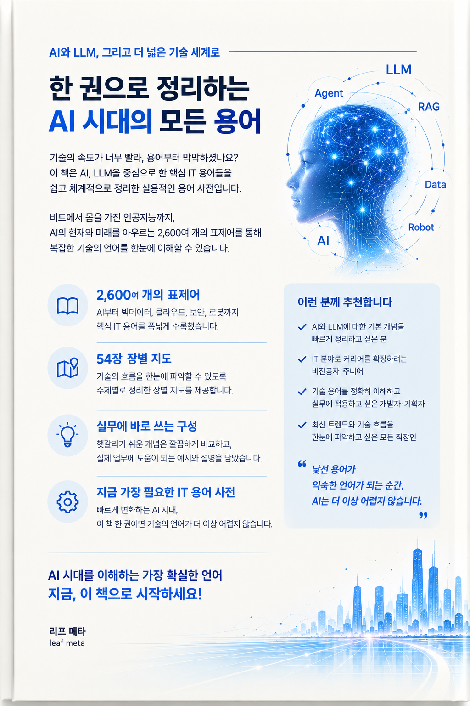

# AI 에이전트 LLM 용어 지도

**비트에서 몸을 가진 인공지능까지, 이어서 읽는 IT 용어 사전**

낱말의 뜻은 검색하면 3초 만에 나옵니다. 그런데 회의에서 실제로 막히는 자리는
뜻을 몰라서가 아닙니다. 그 낱말이 어느 층의 이야기인지 몰라서입니다.

> ### 용어는 정의가 아니라 위치로 이해됩니다.

"그건 서빙 쪽 문제 아닌가요"라는 말이 나왔을 때, 서빙이라는 낱말의 뜻을 아는 것과
그 말이 지금 어느 층을 가리키는지 아는 것은 다른 일입니다.
뜻은 검색이 주고 자리는 안 줍니다. 이 사전은 그 자리를 적었습니다.

**표제어 2,705개.** 낱말마다 한 줄 정의가 있고, 그 낱말이 어느 층에 앉아 있는지와
옆에 무엇이 같이 있는지가 붙어 있습니다. 장마다 여는 지도를 한 장씩 그려서,
그 장의 낱말 대부분이 그림 위에 이름으로 올라갑니다.

표시는 셋입니다. 뜻이 굳은 낱말에는 아무 표시가 없고, 쓰는 사람마다 범위가 갈리는 낱말에는
`[유동]`과 어떻게 갈리는지가, 최근 몇 해 안에 생긴 낱말에는 `[신조]`와 언제 생긴 말인지가 붙습니다.

---

## 내려받기

### → [PDF 받기](https://github.com/leaf-kit/book-ai-era-glossary/releases/latest)

947쪽 · 표제어 2,705개 · 도해 195개 · 사진 8장 · 무료

---

## 목차

**들어가며** — 낱말이 어디서 오고 어떻게 굳고 낡는가  
[0장 용어가 만들어지는 자리](docs/C00.md)

**1부 컴퓨터라는 바닥** — 위층의 낱말이 딛고 서 있는 자리  
[1장 수와 비트, 컴퓨터가 세상을 적는 법](docs/C01.md), [2장 프로세서와 메모리](docs/C02.md), [3장 운영체제와 프로세스](docs/C03.md), [4장 네트워크와 프로토콜](docs/C04.md), [5장 데이터베이스와 저장](docs/C05.md), [6장 프로그래밍 언어와 자료구조](docs/C06.md), [7장 만드는 도구와 협업](docs/C07.md), [8장 클라우드와 컨테이너](docs/C08.md), [9장 보안과 암호](docs/C09.md)

**2부 데이터와 수의 최소한** — 뒤를 읽는 데 필요한 만큼의 수학  
[10장 확률과 통계의 최소한](docs/C10.md), [11장 선형대수와 미분의 최소한](docs/C11.md), [12장 데이터를 다루는 일](docs/C12.md)

**3부 기계학습의 뼈대** — 신경망 이전에 굳은 낱말들  
[13장 학습이라는 일](docs/C13.md), [14장 고전 기계학습 모델](docs/C14.md), [15장 평가와 지표](docs/C15.md), [16장 과적합과 일반화](docs/C16.md)

**4부 신경망** — 5부가 꺼내 쓰는 부품 창고  
[17장 신경망의 부품](docs/C17.md), [18장 학습을 돌리는 일](docs/C18.md), [19장 이미지와 합성곱](docs/C19.md), [20장 시퀀스 모델](docs/C20.md), [21장 생성 모델](docs/C21.md)

**5부 언어 모델의 해부** — 이 사전의 중심. 그림이 가장 많은 부  
[22장 텍스트를 숫자로](docs/C22.md), [23장 트랜스포머 해부](docs/C23.md), [24장 어텐션의 변주와 긴 문맥](docs/C24.md), [25장 사전학습](docs/C25.md), [26장 정렬](docs/C26.md), [27장 추론과 디코딩](docs/C27.md), [28장 작게 만들기](docs/C28.md), [29장 여러 감각](docs/C29.md), [30장 생각하는 모델](docs/C30.md)

**6부 프롬프트와 컨텍스트** — 실무에서 가장 많이 찾는 구간  
[31장 프롬프트 엔지니어링](docs/C31.md), [32장 컨텍스트 엔지니어링](docs/C32.md), [33장 검색 증강 생성](docs/C33.md), [34장 벡터 검색과 인덱스](docs/C34.md)

**7부 에이전트** — `[신조]` 표시가 가장 많은 구간  
[35장 에이전트란 무엇인가](docs/C35.md), [36장 도구와 프로토콜](docs/C36.md), [37장 계획과 기억](docs/C37.md), [38장 여러 에이전트](docs/C38.md), [39장 코딩 에이전트](docs/C39.md), [40장 컴퓨터를 쓰는 에이전트](docs/C40.md)

**8부 만들고 운영하기** — 만드는 이야기가 끝나고 돌리는 이야기가 시작되는 자리  
[41장 서빙과 추론 인프라](docs/C41.md), [42장 평가와 벤치마크](docs/C42.md), [43장 관측성과 디버깅](docs/C43.md), [44장 비용과 속도](docs/C44.md), [45장 데이터 플라이휠](docs/C45.md)

**9부 위험과 규범과 지형** — `[유동]` 표시가 가장 많은 구간  
[46장 실패하는 방식](docs/C46.md), [47장 공격과 방어](docs/C47.md), [48장 프라이버시와 권리](docs/C48.md), [49장 규범과 표준](docs/C49.md), [50장 하드웨어와 규모의 경제](docs/C50.md), [51장 지금 움직이는 것들](docs/C51.md)

**10부 몸을 가진 인공지능** — 화면 밖으로 나가면 무엇이 달라지는가  
[52장 몸을 가진 인공지능](docs/C52.md), [53장 로봇 파운데이션 모델](docs/C53.md)

---

## 어디부터 읽나

열 개 부를 다 읽어야 하는 사람은 많지 않습니다. 목적이 정해져 있으면 아래 순서가 빠릅니다.
어느 길이든 1장부터 볼 필요는 없고, 막히는 낱말이 나오면 관련어 줄의 장 번호를 따라 내려가면 됩니다.

| 하려는 일 | 읽는 순서 | 건너뛰어도 되는 곳 |
|---|---|---|
| 프롬프트를 잘 쓰고 싶다 | 22장, 27장, 31장, 32장 | 1부에서 4부 전체 |
| RAG를 만든다 | 22장, 33장, 34장, 42장, 44장 | 3부, 4부 |
| 에이전트를 붙인다 | 35장에서 38장, 03장, 09장, 36장 | 2부, 3부, 4부 |
| 비용을 줄인다 | 22장, 24장, 28장, 41장, 44장 | 6부, 7부, 9부 |
| 평가 체계를 만든다 | 15장, 42장, 43장, 46장 | 1부, 4부 |
| 코딩 도구를 도입한다 | 39장, 07장, 09장, 43장 | 2부, 3부, 4부 |
| 모델을 직접 학습한다 | 2부에서 5부 전체, 50장 | 6부, 7부, 8부 |
| 로봇이나 자율주행을 한다 | 52장, 53장, 03장, 29장 | 6부, 8부 |
| 문서를 읽다 막혔다 | 영문 색인으로 들어온다 | 나머지 전부 |
| 회의에서 살아남는다 | 각 장의 여는 지도와 한눈에 보기 표만 | 표제어 본문 |

급할 때는 장마다 첫 두 쪽만 봐도 됩니다. 여는 지도와 한눈에 보기 표가 거기 있습니다.
54개 장의 첫 두 쪽을 다 모아도 백 쪽 남짓입니다.

앞에서부터 읽으면 계단이 됩니다. 뒤 장에서 앞 장의 낱말이 나올 때는 장 번호를 괄호로 적어 두었고,
설명 없이 뒤 장의 낱말을 쓰는 자리는 없습니다.

---

## 이 저장소에 있는 것

`docs/` 에 장별 문서 54개가 있습니다. 장의 지형, 한눈에 보기 표, 표제어 일람과 한 줄 정의,
자주 헷갈리는 짝, 지금 움직이는 것이 장마다 들어 있습니다.
낱말 하나를 검색으로 찾아온 사람이 그 자리에서 바로 읽을 수 있게 만든 것입니다.
도해 195개와 사진 8장, 기둥 낱말의 본문은 PDF 에 있습니다.

- [약어 풀이표](docs/abbrev.md) — 본문에 나온 약어 203개
- 자주 헷갈리는 짝 297짝은 장별 문서 아래쪽에 있습니다
- 같은 글자인데 층이 달라 다른 것을 가리키는 낱말 74쌍은 책 부록에 모아 두었습니다

---

## 기준 시점

**2026년 9월까지 확인된 것으로 썼습니다.** 사전은 시점이 곧 유효기간입니다.
1부에서 4부까지는 거의 안 낡고, 7부와 9부가 가장 빨리 낡습니다.
숫자는 자릿수 감각을 주려고 대략의 값만 적었습니다. 정확한 값은 그 시점의 공식 문서에 있습니다.

---

무료로 배포할 수 있습니다. 조건은 출처 표기 하나입니다. 자세한 것은 [LICENSE](LICENSE).

